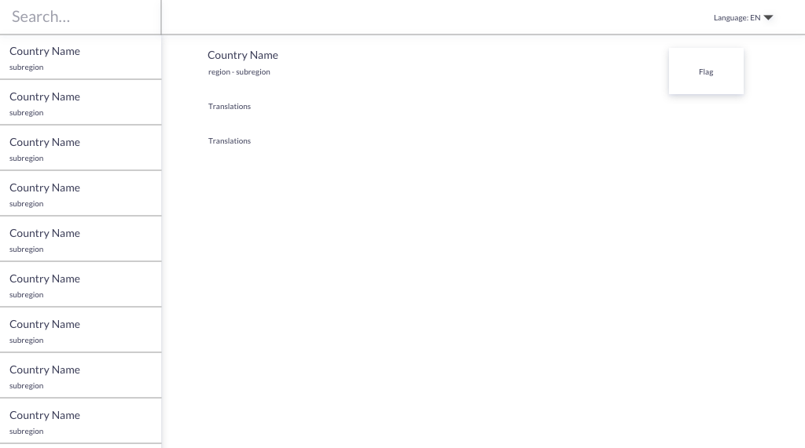

# Country DB

Today we create a small country explorer.
With the help of https://restcountries.eu/ API

## Preview

## Tasks

- Create a views according to the preview image
- Use Context to show country detail view
- Make the list of countries searchable
- Create a language selector to show proper country names
